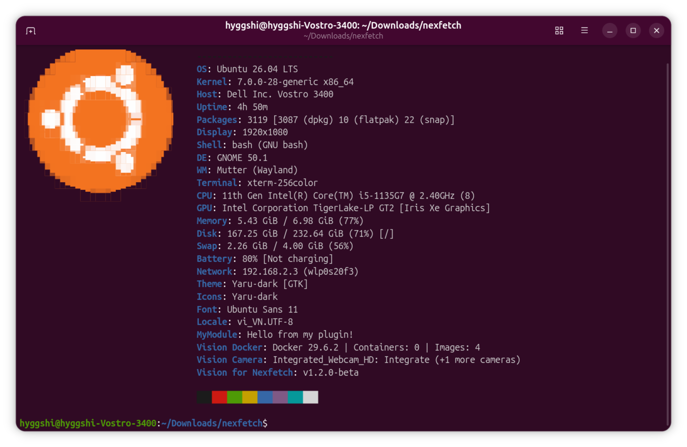
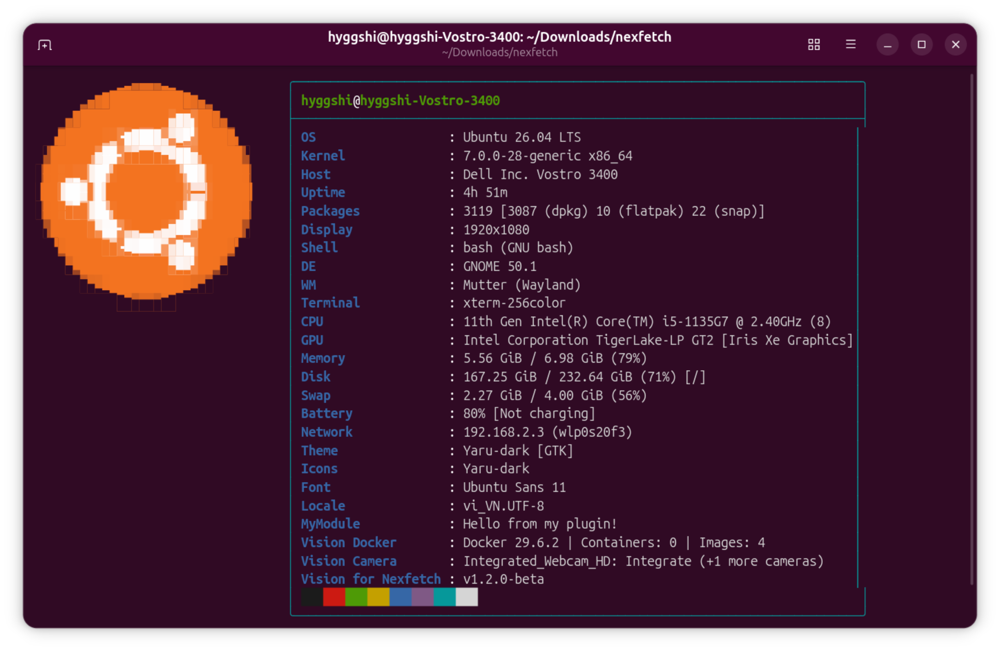
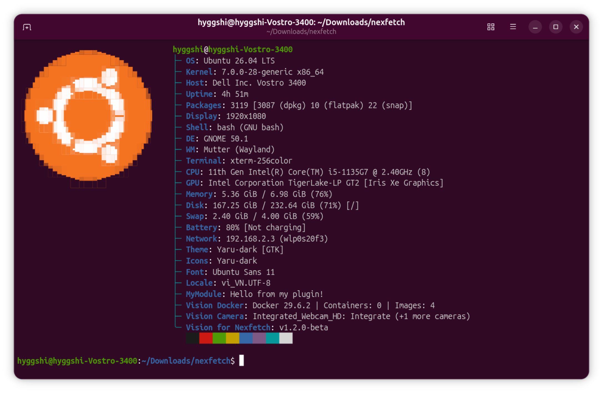
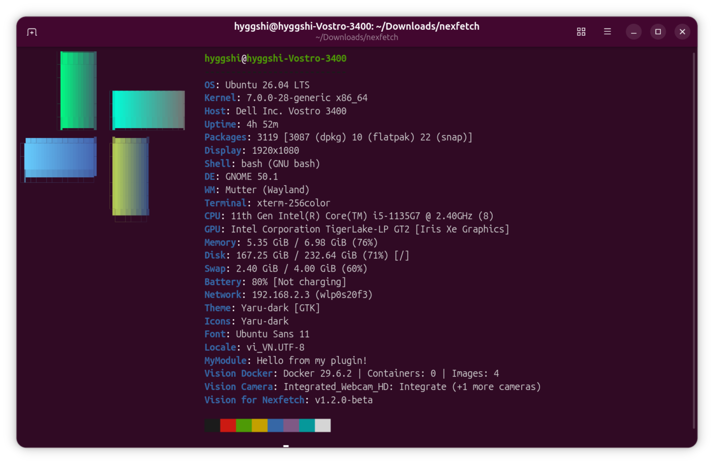
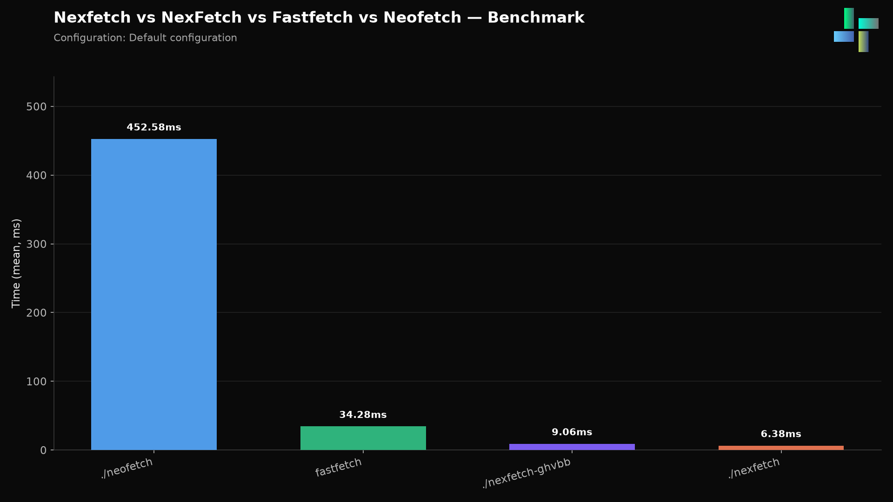
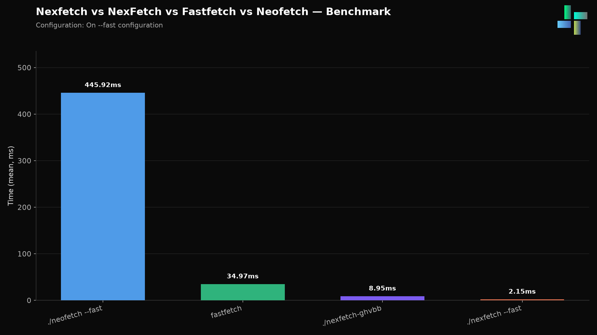

# nexfetch

<p align="center">
  
</p>

<p align="center">
  <strong>A system information tool for Linux, macOS, and Windows.</strong>
</p>

<p align="center">
  <em>Like Neofetch and Fastfetch, but the logo scales itself to the terminal, modules can be added through plugins, and a few display styles come built in.</em>
</p>

| Language | README |
|----------|--------|
|  English | [English](README.md) |
|  Tiếng Việt | [Tiếng Việt](README_VI.md) |
|  简体中文 | [简体中文](README_zh.md) |






> [!WARNING]
> This is an independent project. It has no connection to ghvbb/NexFetch.

---

## Features

- Runs on Linux, macOS, and Windows (native, plus MinGW/MSYS/Cygwin)
- 21 built-in modules, extendable with dynamic plugins
- Three display styles: `boxed` (default), `classic`, `modern`
- Logos as ASCII `.txt` files or images (PNG/JPG/GIF), converted to ANSI through [`chafa`](https://github.com/hpjansson/chafa)
- The logo turns off on its own when the terminal is too narrow to fit it
- Configured through a JSON file or command-line flags
- Loads `.so`/`.dll` modules at runtime
- Written in C, few dependencies

## Installation

Every `v*` tag release publishes builds for `amd64`, `arm64`, and `armhf` on the [Releases page](https://github.com/Hyggshi-OS-Foundation/nexfetch/releases). Pick the method that matches your distro below; if it isn't listed, build from source.

| Distro family | Examples | Package | Arch coverage |
| --- | --- | --- | --- |
| Debian | Debian, Ubuntu, Linux Mint, Pop!_OS | `.deb` | amd64, arm64, armhf |
| RPM | Fedora, openSUSE, RHEL, CentOS | `.rpm` | amd64, arm64, armhf |
| Arch | Arch Linux, Manjaro, EndeavourOS | `.pkg.tar.zst` | x86_64 only |
| Any | — | `.AppImage` | amd64, arm64 |
| Gentoo, Void, Slackware, and others | — | — | build from source (compiler required) |

### Debian (.deb)

Download the `.deb` for your architecture from Releases, then:

```bash
sudo dpkg -i nexfetch_<version>_<arch>.deb
sudo apt -f install   # fix dependencies if needed
```

To remove:

```bash
sudo apt remove nexfetch
```

### RPM (.rpm)

```bash
sudo rpm -i nexfetch-<version>.<arch>.rpm
# or on dnf/zypper systems:
sudo dnf install ./nexfetch-<version>.<arch>.rpm
```

To remove:

```bash
sudo rpm -e nexfetch
```

### Arch (.pkg.tar.zst)

Only `x86_64` builds are published, since the upstream `archlinux` build container has no `aarch64` image. Download the package from Releases, then:

```bash
sudo pacman -U nexfetch-<version>-1-x86_64.pkg.tar.zst
```

To remove:

```bash
sudo pacman -R nexfetch
```

### AppImage (any distro, no install)

```bash
chmod +x nexfetch-<version>-x86_64.AppImage
./nexfetch-<version>-x86_64.AppImage
```

*(use the `aarch64` build on ARM64 machines)*

### Build from source

Required for Gentoo, Void, Slackware, or any distro without a prebuilt package above, and works on the others too if you'd rather skip the package manager.

#### You'll need

- A C compiler (`gcc` or `clang`)
- `make`
- `chafa` (optional, only needed for image logos)

#### Build

```bash
git clone https://github.com/Hyggshi-OS-Foundation/nexfetch.git
cd nexfetch
make
```

This puts a `nexfetch` executable (`nexfetch.exe` on Windows) in the project root.

#### Install system-wide

```bash
sudo make install
```

This copies:
- The `nexfetch` binary to `/usr/bin/nexfetch`
- Logos to `/usr/share/nexfetch/logos/`
- A default config to `/etc/nexfetch/config.json`

To remove:

```bash
sudo make uninstall
```

### Run

```bash
make run
# or directly:
./nexfetch
```

### Clean

```bash
make clean
```

## Usage

```bash
nexfetch [options]
```

### Flags

| Flag | Description |
| --- | --- |
| `-h`, `--help` | Show help and available options |
| `-v`, `--version` | Print version information |
| `--no-logo` | Turn off the ASCII logo |
| `--logo <path>` | Use a custom logo file (`.txt` or image) |
| `--theme <name>` | Set display style: `boxed`, `classic`, or `modern` |
| `--list-modules` | List all registered modules |

### Examples

```bash
# Default run, logo picked automatically for your distro
./nexfetch

# Old neofetch-style layout
./nexfetch --theme classic

# Custom image logo
./nexfetch --logo logos/Tux.png

# No logo, info only
./nexfetch --no-logo

# See every available module
./nexfetch --list-modules
```

## Configuration

nexfetch reads `config/config.json` on startup. Here's the default:

```json
{
  "show_logo": true,
  "color_blocks": true,
  "theme": "boxed",
  "logo": "",
  "logo_width": 16,
  "background_image": "",
  "plugins": [
    "plugins/myplugin.so"
  ],
  "modules": [
    "os", "kernel", "host", "uptime", "packages", "display",
    "shell", "de", "wm", "terminal", "cpu", "gpu", "memory",
    "disk", "swap", "battery", "network", "theme", "icons",
    "font", "locale"
  ]
}
```

| Key | Type | Description |
| --- | --- | --- |
| `show_logo` | boolean | Show or hide the ASCII logo |
| `color_blocks` | boolean | Show or hide the color bar |
| `theme` | string | Display style: `boxed`, `classic`, `modern` |
| `logo` | string | Path to a custom logo file (`.txt` or image) |
| `logo_width` | integer | Column width for image logos (used with `chafa`) |
| `background_image` | string | Path to an image rendered as a full-terminal background (needs `chafa`) |
| `plugins` | array | Paths to plugin libraries (`.so`/`.dll`) to load |
| `modules` | array | Order in which modules are displayed |

> Command-line flags override anything set in `config.json`.

## Modules

nexfetch ships with 21 modules:

| Module | Key | Description |
| --- | --- | --- |
| OS | `os` | Operating system name and version |
| Kernel | `kernel` | Kernel release string |
| Host | `host` | Device/host model |
| Uptime | `uptime` | System uptime |
| Packages | `packages` | Installed package count |
| Display | `display` | Screen resolution |
| Shell | `shell` | Current shell |
| DE | `de` | Desktop environment |
| WM | `wm` | Window manager |
| Terminal | `terminal` | Terminal emulator |
| CPU | `cpu` | CPU model and core count |
| GPU | `gpu` | GPU model |
| Memory | `memory` | RAM in use |
| Disk | `disk` | Disk space in use |
| Swap | `swap` | Swap in use |
| Battery | `battery` | Battery status |
| Network | `network` | Network interface info |
| Theme | `theme` | Current theme |
| Icons | `icons` | Icon set |
| Font | `font` | Current font |
| Locale | `locale` | System locale |

### Writing a plugin

Plugins are shared libraries (`.so` on Linux/macOS, `.dll` on Windows) that export three symbols:

```c
// my_plugin.c
#include <stdio.h>
#include <stddef.h>

const char *plugin_name = "MyModule";
const char *plugin_key  = "mymodule";

void plugin_detect(char *out, size_t max_len) {
    snprintf(out, max_len, "Hello from my plugin!");
}
```

Compile and load it:

```bash
# Linux/macOS
gcc -shared -fPIC -o plugins/myplugin.so my_plugin.c

# Windows
gcc -shared -o plugins/myplugin.dll my_plugin.c
```

The plugin is loaded at runtime by `module_manager_load_plugin()`, which resolves `plugin_name`, `plugin_key`, and `plugin_detect`.

### Vision Plugin (camera/webcam)

nexfetch includes a Vision Plugin that finds and displays camera/webcam information:

```c
// plugins/vision.c
#include <stdio.h>
#include <stdlib.h>
#include <string.h>
#include <stddef.h>
#include <dirent.h>

const char *plugin_name = "Vision Camera";
const char *plugin_key  = "visioncamera";

static void trim(char *s)
{
    size_t len = strlen(s);
    while (len && (s[len - 1] == '\n' || s[len - 1] == '\r'))
        s[--len] = '\0';
}

/* Count video devices in /sys/class/video4linux/ */
static int count_video_devices(void)
{
    DIR *dir = opendir("/sys/class/video4linux");
    if (!dir) return 0;

    int count = 0;
    struct dirent *ent;
    while ((ent = readdir(dir)) != NULL) {
        if (strncmp(ent->d_name, "video", 5) == 0)
            count++;
    }
    closedir(dir);
    return count;
}

/* Get the first camera name from /sys/class/video4linux/videoX/name */
static void get_first_camera_name(char *out, size_t max_len)
{
    DIR *dir = opendir("/sys/class/video4linux");
    if (!dir) {
        snprintf(out, max_len, "Unknown");
        return;
    }

    struct dirent *ent;
    while ((ent = readdir(dir)) != NULL) {
        if (strncmp(ent->d_name, "video", 5) != 0) continue;

        char path[512];
        snprintf(path, sizeof(path), "/sys/class/video4linux/%s/name", ent->d_name);

        FILE *fp = fopen(path, "r");
        if (fp) {
            if (fgets(out, (int)max_len, fp))
                trim(out);
            fclose(fp);
            closedir(dir);
            return;
        }
    }
    closedir(dir);
    snprintf(out, max_len, "Unknown");
}

void plugin_detect(char *out, size_t max_len)
{
    int count = count_video_devices();
    char name[128] = "Unknown";

    if (count > 0)
        get_first_camera_name(name, sizeof(name));

    if (count <= 0) {
        snprintf(out, max_len, "No camera detected");
        return;
    }

    if (count == 1) {
        snprintf(out, max_len, "%s (1 camera)", name);
    } else {
        snprintf(out, max_len, "%s (+%d more cameras)", name, count - 1);
    }
}
```

Compile the Vision Plugin:

```bash
# Linux/macOS
gcc -shared -fPIC -o plugins/vision.so plugins/vision.c

# Windows (needs a V4L2 emulation layer)
gcc -shared -o plugins/vision.dll plugins/vision.c
```

Then register it in `config/config.json`:

```json
{
  "plugins": ["plugins/vision.so"],
  "modules": [ "os", "kernel", "...", "visioncamera" ]
}
```

**How it works:**

| Step | Description |
| --- | --- |
| Scan | `count_video_devices()` scans `/sys/class/video4linux/` and counts `video*` nodes |
| Name | `get_first_camera_name()` reads the device name from `videoX/name` |
| Output | Prints `Camera name (N cameras)`, or `No camera detected` if nothing is found |

**Example output:**

```
Vision Camera: Integrated_Webcam_HD: Integrate (+1 more cameras)
```

> On Linux, one physical webcam often exposes several `/dev/videoN` nodes at once (say, `video0` for capture and `video1` for metadata). The Vision Plugin counts all of them.

### Vision for Nexfetch Plugin (version)

A small plugin that prints the Vision for Nexfetch version, read directly from the running `nexfetch` binary instead of being hardcoded:

```c
// plugins/vision_nexfetch.c
#include <stdio.h>
#include <stddef.h>
#include <string.h>
#ifdef _WIN32
#include <windows.h>
#else
#include <dlfcn.h>
#endif

const char *plugin_name = "Vision for Nexfetch";
const char *plugin_key  = "vision_nexfetch";

void plugin_detect(char *out, size_t max_len)
{
    const char *version = "unknown";

#ifdef _WIN32
    HMODULE host = GetModuleHandleA(NULL);
    if (host) {
        const char **ver_ptr = (const char **)GetProcAddress(host, "nexfetch_version");
        if (ver_ptr && *ver_ptr)
            version = *ver_ptr;
    }
#else
    const char **ver_ptr = (const char **)dlsym(RTLD_DEFAULT, "nexfetch_version");
    if (ver_ptr && *ver_ptr)
        version = *ver_ptr;
#endif

    snprintf(out, max_len, "v%s", version);
}
```

Compile and register it:

```bash
gcc -shared -fPIC -o plugins/vision_nexfetch.so plugins/vision_nexfetch.c
```

```json
{
  "plugins": ["plugins/vision_nexfetch.so"],
  "modules": [ "os", "kernel", "...", "vision_nexfetch" ]
}
```

**Example output:**

```
Vision for Nexfetch: v1.1.0
```

> Notes:
> - The presenter adds the plugin name as a prefix on its own (`Vision for Nexfetch: <value>`), so `plugin_detect()` only needs to write the version string.
> - On Linux/macOS, nexfetch is built with `-rdynamic` and exports the `nexfetch_version` symbol (defined in `src/module_manager.c`). The plugin resolves it at runtime with `dlsym(RTLD_DEFAULT, "nexfetch_version")`, so the version always matches the running binary and never needs a manual update.
> - On Windows, the plugin reads the same symbol from the host executable through `GetProcAddress`.

To bump the nexfetch version, only `NEXFETCH_VERSION` in `include/nexfetch.h` needs to change; the plugin picks it up on its own.

## Themes

| Theme | Description |
| --- | --- |
| `boxed` | Info inside a rounded Unicode box (default) |
| `classic` | Traditional neofetch-style key: value layout |
| `modern` | Tree layout with `├─` / `╰─` connectors |

## Logos

Logos live in `logos/`. nexfetch supports two formats:

- ASCII text (`.txt`) — plain ANSI art, loaded as is
- Images (`.png`, `.jpg`, `.gif`, etc.) — converted to ANSI art through `chafa`

### Logo resolution order

1. Custom path from `config.json`'s `"logo"` field, or the `--logo` flag
2. `logos/<distro_id>.txt` (detected from `/etc/os-release`)
3. `logos/tux.txt` (fallback)

### Built-in logos

| File | Distro |
| --- | --- |
| `nexfetch.png` | nexfetch project logo (image) |
| `nexfetch.txt` | nexfetch project logo (ASCII) |
| `alpine.txt` | Alpine Linux |
| `arch.txt` | Arch Linux |
| `debian.txt` | Debian |
| `fedora.txt` | Fedora |
| `hyggshi_OS.txt` | Hyggshi OS |
| `tux.txt` | Tux (generic Linux fallback) |
| `ubuntu.txt` | Ubuntu |
| `Tux.png` | Tux (image) |
| `Windows_logo_11.png` | Windows 11 (image) |

### Auto-scaling

If the logo and info box together don't fit the terminal width, nexfetch hides the logo so the output stays readable.

## Project structure

```
nexfetch/
├── config/
│   └── config.json          # Default configuration
├── include/                 # Public headers
│   ├── module.h             # Module system API
│   ├── nexfetch.h           # Core types, config, color macros
│   ├── platform.h           # Platform abstraction API
│   ├── presenter.h          # Theme/presenter API
│   └── util.h               # Utility functions
├── logos/                   # ASCII and image logos
├── modules/                 # Built-in module implementations
│   ├── ansi.c               # ANSI visible-length calculator
│   ├── battery.c
│   ├── color.c              # Color blocks bar
│   ├── cpu.c
│   ├── custom.c
│   ├── de.c
│   ├── disk.c
│   ├── display.c
│   ├── gpu.c
│   ├── host.c
│   ├── kernel.c
│   ├── locale.c
│   ├── logo.c               # Logo loader (txt + image via chafa)
│   ├── memory.c
│   ├── network.c
│   ├── os.c
│   ├── packages.c
│   ├── shell.c
│   ├── swap.c
│   ├── uptime.c
│   └── ...
├── platform/                # Platform-specific backends
│   ├── linux/               # Linux implementation
│   ├── macos/                # macOS implementation
│   └── windows/              # Windows implementation
├── plugins/                 # Drop-in plugin directory (shared libs)
├── src/                     # Core source files
│   ├── config.c             # JSON config parser
│   ├── main.c                # Entry point and CLI handling
│   ├── module_manager.c      # Module registry + plugin loader
│   ├── presenter.c           # Theme renderers
│   └── util.c                 # Shared utilities
├── Makefile                 # Build system
├── LICENSE                  # GPL-3.0
└── README.md
```

## Building

The Makefile detects the platform and picks the right source files:

```bash
make          # Build nexfetch
make run      # Build and run
make clean    # Remove build artifacts
```

### Platform notes

- Linux: links against `-ldl` for dynamic plugin loading
- macOS: uses `platform/macos/platform_macos.c`
- Windows: uses `platform/windows/platform_windows.c`, builds `nexfetch.exe`

### CI/CD

Every push of a `v*` tag triggers `.github/workflows/release.yml`, which builds `amd64`/`arm64`/`armhf`, packages `.deb`, `.rpm`, an `x86_64` Arch package, and `amd64`/`arm64` AppImages, then publishes all of them to GitHub Releases.

## Benchmark

Measured on the same machine, each tool run repeatedly and timed. Lower is better.

### Default configuration

| Tool | Mean | Median | Stdev | Min | Max |
| --- | --- | --- | --- | --- | --- |
| `./nexfetch` | 6.38ms | 6.29ms | 0.44ms | 5.76ms | 8.03ms |
| `./nexfetch-ghvbb` | 9.06ms | 8.91ms | 0.72ms | 8.33ms | 14.03ms |
| `fastfetch` | 34.28ms | 33.95ms | 1.34ms | 32.67ms | 39.37ms |
| `./neofetch` | 452.58ms | 446.10ms | 19.21ms | 431.15ms | 577.88ms |



### `--fast` configuration

| Tool | Mean | Median | Stdev | Min | Max |
| --- | --- | --- | --- | --- | --- |
| `./nexfetch --fast` | 2.15ms | 2.08ms | 0.28ms | 1.81ms | 3.79ms |
| `./nexfetch-ghvbb` | 8.95ms | 8.93ms | 0.26ms | 8.45ms | 10.28ms |
| `fastfetch` | 34.97ms | 34.15ms | 3.26ms | 32.65ms | 61.37ms |
| `./neofetch --fast` | 445.92ms | 442.80ms | 10.68ms | 430.28ms | 487.43ms |



nexfetch comes out around 5x faster than fastfetch and roughly 70-200x faster than neofetch in both configurations. `nexfetch-ghvbb` here refers to [ghvbb/NexFetch](https://github.com/ghvbb/NexFetch), an unrelated project with a similar name, included for reference since people sometimes confuse the two.

## License

This project is licensed under the GNU General Public License v3.0. See [LICENSE](LICENSE) for the full text.

## Repository

- Source: [https://github.com/Hyggshi-OS-Foundation/nexfetch](https://github.com/Hyggshi-OS-Foundation/nexfetch)
- Issues: [https://github.com/Hyggshi-OS-Foundation/nexfetch/issues](https://github.com/Hyggshi-OS-Foundation/nexfetch/issues)

---

<p align="center">
  Built by <a href="https://github.com/Hyggshi-OS-Foundation">Hyggshi OS Foundation</a> and <a href="https://github.com/Hyggshi-OS-Research-Technology">Hyggshi OS Research Technology</a>
</p>